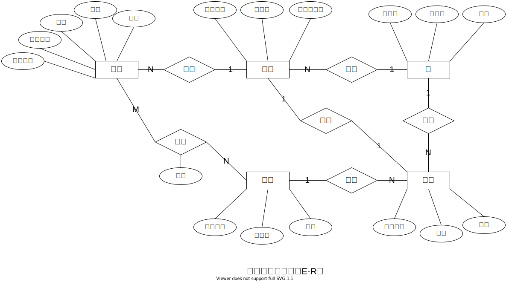
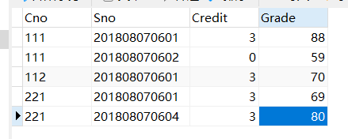

# 需求分析

 系统需求分析是数据库设计和系统实现的基础，其任务是:掌握用户对系统建设的要求，研究相应管理工作的特点，找出数据、业务过程和实现管理功能之间的关系，确定系统的功能。

　　下面将对大学生教务管理信息系统的各个方面要求做出分析。系统建设目标是建成一个集自动化、信息化、网络化为一体的，符合高校教务管理特点的大学生教务管理信息系统，为教务管理有关部门提供优质、高效的业务管理和事务处理，为其它有关部门、学生和教师提供全面及时的信息和数据。系统完成时应达到以下几方面的

要求:

  　　1. 功能实用:根据教务管理业务流程，提供日常教学管理功能。

2. 技术先进:采用先进的计算机软硬件技术，确保本系统在相当长的时间内不会落后。

3. 高效稳定:系统运行速度快，效率高，有效防止各种人为操作错误，维护数据的完整性。

4. 易于操作:系统界面简洁，易使用、易维护、适应非计算机人员使用。

5. 安全可靠:应具有安全高效的身份认证，权限检查机制，防止信息泄密和对保信息的非法侵入

##  信息需求

教务管理系统涉及的实体有：

- 教师——工作证号、姓名、职称、所教授的课程等

- 学生——学号、姓名、性别、班级、所在系、专业、学籍状态等

- 系——系编号、系名、系主任、所在学院等

- 课程——课程号、课程名、学分等

- 班级——班级编号等

实体间的联系如下：

- 每个学生属于一个班，一个班属于一个系，每个教师也属于一个系

- 每个班的班主任由一名教师担任

- 一个教师可以教多门课，一门课可以有多位老师教授

- 一名同学可以选多门课

##  功能需求

系统的用户有三个不同的角色，分别是教务教师，管理人员，学生，角色不同，需求不同。通过分析，各用户的需求如下：

 

### 教师用户需求

教师可以通过系统录入、查看、修改学生成绩，查看上课课表等教学信息。还可查询所教课程的所有学生基本信息，班主任可查看所带班级学生的详细信息。

###  教务管理人员用户需求

教务管理人员可以进行学生信息管理，包括录入、查看、修改及删除学生，处理并审核学生休学、退学等学籍异动信息。可进行成绩管理，包括维护、生成学生成绩名单，管理成绩录入错误的修改、审批，打印学习成绩一览表，提供平均学分绩、单科课程成绩、综合成绩排名信息。

可进行教师管理，包括录入、查看、修改及删除教师。对老师所授课程，所带班级等信息进行修改调整。

###  学生用户需求

学生可以查询个人信息、教师、查看成绩、成绩单、课表等信息。


## 性能需求

保证数据的准确性，实时性，共享性、独立性，完整性和一致性。


# 数据库概念结构设计


## 概念模型（E-R图）


 




## 数据字典


### 数据项

| 属性名     | 存储代码  | 类型    | 长度 | 备注       |
| ---------- | --------- | ------- | ---- | ---------- |
| 学号       | Sno       | char    | 14   | 学生编号   |
| 姓名       | Sname     | varchar | 25   | 学生的姓名 |
| 性别       | Ssex      | char    | 2    | 学生的性别 |
| 出生年月   | Sbirth    | date    |      | 出生时间   |
| 学籍状态   | Sstatus   | char    | 10   |            |
| 班号       | ClassID   | char    | 6    | 班级编号   |
| 班级名     | ClassName | varchar | 20   |            |
| 平均总学分 | SvgCredit | float   | 4    |            |
| 工作证号   | Tno       | char    | 20   | 教师的编号 |
| 教师姓名   | Tname     | char    | 6    | 教师的姓名 |
| 职称       | Title     | varchar | 20   | 教师的职称 |
| 系代号     | Dno       | char    | 3    | 院系的编号 |
| 系名       | Dname     | varchar | 26   |            |
| 课序号     | Cno       | char    | 6    |            |
| 课名       | Cname     | varchar | 20   |            |
| 学分       | Credit    | float   |      |            |
| 学时       | Ctime     | int     |      |            |
| 成绩       | Grade     | float   |      |            |


### 数据结构

| 编号 | 数据结构名 | 组成                                                         |
| ---- | ---------- | ------------------------------------------------------------ |
| 1    | 学生       | 学号，姓名，性别，出生年月，所在班级班号，学籍状态           |
| 2    | 教师       | 工作证号，教师姓名，教师性别，教师年龄，职称，所在系的系代号 |
| 3    | 班级       | 班号，平均总学分，班主任工作证号，所在系的系号               |
| 4    | 系         | 系代号，系名，系主任                                         |
| 5    | 课程       | 课程编号，课名，学分，学时，上课老师工作证号                 |
| 6    | 选课记录   | 课程编号，学号，成绩                                         |


# 数据库逻辑结构设计

## E-R图向关系模型的转换

- 学生（**学号**，姓名，性别，出生年月，*班级编号*，*系代号*）

	代码表示：Student(Sno，Sname，Ssex，Sbirth，Class，Dno) 

	其中，学号为其候选码，又因为学生与班级之间是n：1的“属于”关系，经过与班级关系模式的合并后，班号Class成为学生关系模式的外码，存在的关系依赖为 
	Sno →(Sname，Ssex，Sbirth，Class，Dno),

	Class→Dno,存在对候选码的传递依赖，所以 满足2NF. 

- 班级（**班级编号**，平均总学分，工作证号，*系代号*）

	代码表示：Class(Class，SvgCredit，Tno，Dno) 

	其中，班号为其候选码，又由于班级与系别之间是n：1的“属于”关系，经过 “班级”与“系别”两个实体关系模式的合并后，系号被合并为班级对应的关系模式的外码。而班级与教师之间是1：1的“负责”关系，所以按照规定，教师的 工作证号也被合并为班级的外码。

	存在的函数依赖为Class→(Ccredit,.Tno.Dno), 
	其中Class→Tno,而Tno→Dno,即存在对候选码的传递依赖，所以只满足2NF。

- 教师（**工作证号**，姓名，职称，*所在系的系代号*）

	代码表示为：Teacher（Tno，Tname，Title，Dno）

	其中工作证号为其候选码，又因为教师与系别之间是 n：1的工作关系，经过与系别关系模式合并后，系代号Dno成为教师关系模式的外码，

	存在依赖为Tno→（Tname，Title，Dno），

	不存在对候选码的部分依赖与传递依赖，所以满足3NF 

- 课程（**课程编号**，课程名，学分，工作证号） 
	代码表示：Course(Cno，Cname，Credit，Tno) 
	其中，课号为其候选码，又由于课程与教师之间是n：1的授课关系，所以经过 关系模式的合并后，教师的工作证号被合并为课程关系模式中的外码。

	存在的函数依赖为Cno→(Cname,Credit,Cnum,Tno),且不存在对候选码的部分依赖和传递依赖，所以满足3NF。
	
- 系（**系代号**，系名）
	代码表示：Sdept(Dno，Dname，Tno) 系代号为候选码，

	存在的函数依赖为Dno→(Dname,DM), 且不存在部分依赖与传递依赖，所以满足3NF。 


# 数据库物理结构设计

## 数据库文件


### 选择存取方法

数据库管理系统自动在每个表的主码上建立索引，通常为B+树索引。

### 确定数据库存储结构

1. 为了提高系统的性能，根据具体情况将数据易变部分与稳定部分和存取频率较低的部分分开存放。

2. DBMS产品一般都提供了一些系统配置变量，存储分配参数，根据应用环境确定这些参数数值，并且在系统允许时还要根据系统实际运行情况进行调整，以使系统性能最佳

# 数据表的物理结构


### 学生信息物理结构设计

| 字段名       | 数据类型    | 约束       |
| ------------ | ----------- | ---------- |
| 学生学号     | char(14)    | 主键       |
| 学生姓名     | varchar(25) | 不允许为空 |
| 学生性别     | char(2)     | 不允许为空 |
| 学生出身年月 | date        | 不允许为空 |
| 学生年龄     | int         | 不允许为空 |
| 学籍状态     | varchar(10) | 不允许为空 |
| 学生班号     | char(8)     | 允许为空   |

### 教师信息物理结构设计

| 字段名     | 数据类型    | 约束       |
| ---------- | ----------- | ---------- |
| 教师工号   | char(6)     | 主键       |
| 教师姓名   | varchar(20) | 不允许为空 |
| 教师性别   | char(2)     | 不允许为空 |
| 教师年龄   | int         | 不允许为空 |
| 所在系代号 | char(3)     | 允许为空   |
| 教师职称   | varchar(20) | 允许为空   |

### 课程信息物理结构设计

| 字段名       | 数据类型    | 约束       |
| ------------ | ----------- | ---------- |
| 课程号       | char(6)     | 主键       |
| 课程名       | varchar(20) | 不允许为空 |
| 学分         | float       | 不允许为空 |
| 学时         | int         | 不允许为空 |
| 上课老师工号 | char(6)     | 不允许为空 |

### 班级信息物理结构设计

| 字段名     | 数据类型    | 约束       |
| ---------- | ----------- | ---------- |
| 班级号     | char(6)     | 主键       |
| 班级名     | varchar(20) | 不允许为空 |
| 班主任工号 | char(6)     | 允许为空   |
| 所在系代号 | char(3)     | 不允许为空 |

### 系信息物理结构设计

| 字段名 | 数据类型    | 约束       |
| ------ | ----------- | ---------- |
| 系代号 | char(3)     | 主键       |
| 系名   | varchar(26) | 不允许为空 |
| 系主任 | char(6)     | 允许为空   |

### 选修信息物理结构设计

| 字段名   | 数据类型 | 约束 |
| -------- | -------- | ---- |
| 课程号   | char(6)  | 主键 |
| 学生学号 | char(14) | 主键 |
| 学分     | float    |      |
| 成绩     | float    |      |


# 数据库的实施

## 创建数据库 

1. 建库

	```mysql
	create database if not exists AMS
	
	DEFAULT CHARACTER SET utf8mb
	
	DEFAULT COLLATE utf8_chinese_ci;
	
	```
	
2. 学生信息表的创建

	```mysql
	create table student
	
	(Sno char(11) primary key,
	
	Sname varchar(25) not null,
	
	Ssex char(2) not null,
	
	Sage int not null,
	 
	Sbirth data not null,
	
	ClassID char(8),
	
	Sstatus varchar(10) not null;
	
	)
	```
	
	

3. 教师基本信息表的创建

	``` mysql
	create table teacher
	
	(Tno char(6) primary key,
	
	Tname varchar(20) not null,
	
	Tsex char(2) 
	
	TAge int not null,
	
	Title varchar(20) not null,
	
	Dno char(3),
	
	)
	
	```
	
	
	
4. 课程基本信息表的创建

	```mysql
	create table course
	
	(Cno char(6) primary key,
	
	 Cname varchar(20) not null,
	
	 Credit float not null,
	 
	 Ctime int not null,
	
	 Tno char(20) not mull, 
	
	)
	```
	
	
	
5. 班级基本信息表的创建

  ```mysql
    Creat table class
  
     (ClassID int(11) primary,
  
     ClassName varchar(20) not null,
  
     Dno char(3) not null,
      
     Tno char(6) not null,
      
     SvgCredit float,
  
  )
  ```

  

6. 选修基本信息表的创建

  ```mysql
     Creat table sc
  
     (Sno  char(14)  primary key,
  
     Cno  char(6)  primary key,
  	
     Credit float null,
      
     Grade float  null,
  
  )
  ```

  

7. 系基本信息表的创建

  ```mysql
  Creat table department
  
     (Dno char(3) primary key,
  
     Dname  varchar(26) not null,
  
     Tno  char(6)  not null,
  
  )
  ```

  

## 创建数据表

1. 学生基本信息

	
	
2. 教师基本信息

	
	
3. 班级基本信息

  

 

4. 系基本信息


5. 选修基本信息

	

6. 课程信息

	


## 创建视图

```mysql
CREATE VIEW `ams`.`teach_task` AS SELECT
	teacher.Tno,
	Tname,
	Cname,
	Ctime 
FROM
	teacher,
	course 
WHERE
	teacher.Tno = course.Tno;
	
CREATE VIEW `ams`.`teacher_info` AS SELECT
	teacher.Tno, 
	teacher.Tname, 
	teacher.Tsex, 
	teacher.Tage, 
	teacher.Title, 
	sdept.Dname, 
	class.ClassName
FROM
	teacher,
	sdept,
	class
WHERE
	teacher.Dno = sdept.Dno AND
	teacher.Tno = class.Tno;

CREATE VIEW `ams`.`student_info` AS SELECT
	student.Sno, 
	student.Sname, 
	class.ClassName, 
	sc.Cno, 
	sc.Credit, 
	sc.Grade, 
	teacher.Tname
FROM
	student,
	class,
	sc,
	teacher
WHERE
	(
		class.Tno = teacher.Tno AND
		student.ClassID = class.ClassID
	);
	
```


## 创建存储过程和触发器 

```mysql
//插入触发器
CREATE TRIGGER trigger_insert
	AFTER INSERT on t_student FOR each row
	INSERT INTO log (time,operation,detail)
			VALUES (NOW(), 'INSERT', CONCAT('新记录：',NEW.Sno,NEW.Sname,NEW.Ssex,NEW.Sage,NEW.ClassID,NEW.Sstatus));

//更新触发器			
CREATE TRIGGER trigger_update 
		AFTER UPDATE ON t_student FOR EACH ROW
		INSERT INTO log ( time, operation, detail)
		VALUES (NOW(), 'UPDATE', CONCAT('(',
				OLD.Sno, OLD.Sname, OLD.Ssex, OLD.Sage,OLD.ClassID,OLD.Sstatus')',
				'->', '(', NEW.Sno,NEW.Sname,NEW.Ssex,NEW.Sage,NEW.ClassID,NEW.Sstatus ')'));
```


# 数据库的运行和维护

## 数据库的维护

在数据库运行阶段，对数据库经常性的维护工作主要由DBA完成，它包括：

1. 数据库的转储和回复

2. 数据库的安全性的完整性控制

3. 数据库性能的监督，分析和改造
4.  数据库的重组织与重构造

维护：数据库既是共享的资源，又要进行适当的保密，DBA必须对数据库安全性和完整性控制负起责任，尤其在计算机网络普遍引用的今天，保证数据的安全，防止黑客攻击，病毒入侵等，都是DBA所面对的。DBA需要经常检查系统的安全是否受到侵犯，根据用户的实际需要授予用户不同的操作权限，数据库在运行过程中，由于运行环境发生变化，对安全性的要求也发生变化，DBA需要根据实际要求及时调整，以保证数据库的安全。

## 重新组织和构造数据库

数据库运行一段时间后，由于记录在不断增加，删除和修改，会改变数据库的物理存储结构，使数据库的物理特性受到破坏，从而降低数据库的存储孔家的利用率和数据的存取效率，使数据库的性能下降，因此，需要对数据库进行重新组织，即重新安排数据的的存储，回收垃圾，改进数据库的响应时间和空间利用率，提高系统性能。数据库的重组只是使数据库的物理存储结构，而数据库的逻辑结构不变，所以根据数据库的三级模式，可以知道数据的重组对系统功能没有影响，只是为了人提高系统化的性能。

由此可知，数据库的重组并不会改变设计的数据逻辑结构和物理结构，而数据库的重构造则不同，他部分修改源数据库的模式或内模式，这主要是因为数据库的应用环境发生了变化，如需求变化，设计调整等。例如增加新的数据项，改变数据类型，增加或删除索引，修改完整性约束等。只要数据库系统在运行，就需要不断地进行修改，调整和维护，一旦应该用变化太大，数据库重新组织和构造也无济于事，这就表明数据库应用系统的生命周期结束，应建立新系统，重新设计数据库，从头开始。

 

